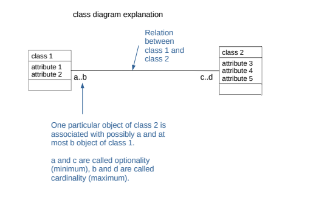
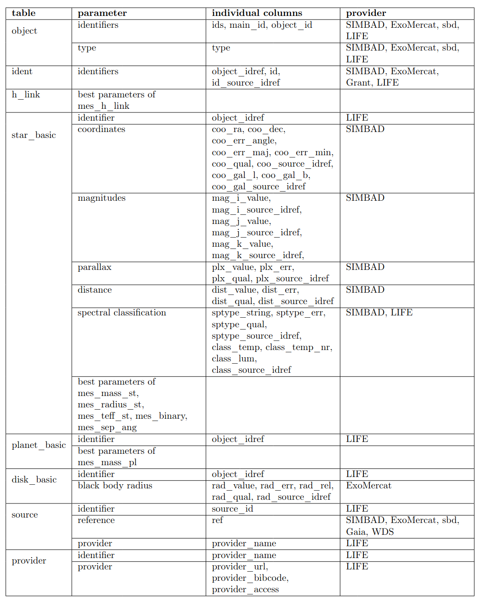
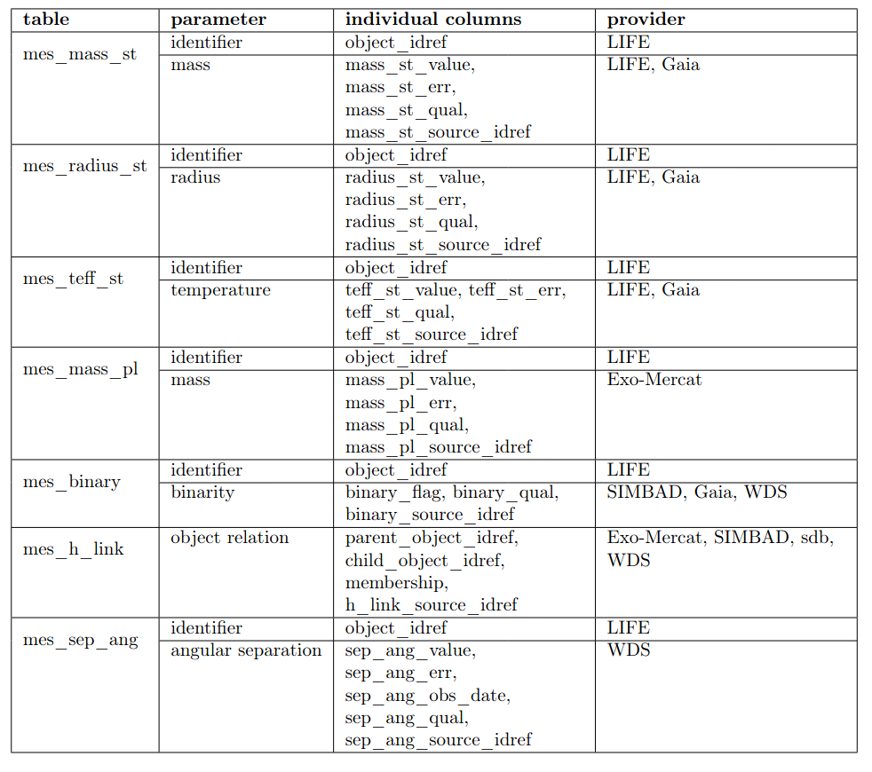

.. _architecture:

Architecture
============

.. _architecture_intro:

Introduction
------------

Let's start with a bit of terminology used when dealing with databases. A `database` is a collection of data. They support electronic storage and maniputlation of data. `Data` itself are facts related to any object in consideration. For example name, age, temperature. A picture, image, file, etc. can also be considered data. There are different ways in which people can interact with the database. In database terminology those are called use cases and describe what a user wants to get out of that interaction. They have consequences on the database design. One of the outcomes whas that we needed the LIFE Target Database to be a `relational database`. That means the data is stored in tables linked to each other with relations. Those tables and relations can be visualized using a `data model`. The use cases and data model for `life_td` are explained in the sections below. 

Use Cases
---------

In database terminology, “use cases” are the different ways in which a user can interact with a database. 
The output desired by the user drives the database design. 
We elaborate below on the most relevant LIFE target database use
cases.

* A: Exploration of Selection Criteria for Target Catalogs
* B: Easy Access for Fellow Scientists
* C: Low Maintenance for Administrator
* D: Identify essential missing data for future observation proposals
* E: Provide context for analysis of data obtained by LIFE

Which have the following consequences on the database features:

A

* A1: 30pc cut -> max distance at which we can in reasonable time observe desired planet
* A2: Main stellar parameters (name, position, distance, spectral type, effective temperature, mass, radius)
* A3: Multiplicity information to predict stable planetary orbits as well as take into account lower planet occurence rates in multiples.
* A4: Disk information to predict observability. Exozodi as noise source.
* A5: Planet information to reduce detection time where planets already known or ruled out from nondetection or Hot Jupiter relation to habitable zone planets.
* A6: Best parameters of data collected from different providers.

B

* B1: `VO <www.ivoa.net>`_ compatibility 
* B2: `Example queries <https://dc.zah.uni-heidelberg.de/life/q/ex/examples>`_ to mitigate ADQL knowledge deficites.
* B3: Tutorials to help create catalog for own science project

C

* C1: Data ingestion as automated as possible. This is achieved by prefering VO compatible data providers over other databases. Those are in turn prefered over modeled data and as a last resort literature data is collected.
* C2: GAVO published, they take care that server runs smoothly.
* C3: Everything public and documented to have good knowledge transfer in case of administrator change.

E

* E1: Flexible database design enabling easy expansion in form of adding parameters (e.g. metalicity), providers (e.g. TESS) or adapt to other use cases that might come up in the future (e.g. planned non detection information).

.. _architecture_data_model:

Data Model
----------

We used the Unified Modeling Language (UML) to create our data model. Each table in the database is represented as a box called a class. The columns of the table are represented by attributes. A relation between two tables is represented by a line. 

TBD: add small example data model from book beginning database design.

The figure below is the general structure of the current data model. It went through many iterations to reach this point. We started with what kind of data we wanted to have in the database and normalized the model as much as possible. Normalization is the concept in database design on how to reduce data redundancey (e.g. having the same information save multiple times in the database)
and improve data integrity (e.g. accumulations of errors occurring during data maintenance). Higher
normalizations have the benefit of write performance (minimized redesign when extending the database structure, and anomaly resistance) at the cost of read performance (e.g. querying). However, it turned out that due to the high normalization our database became too complex with manifested in the way that our queries got too complicated. We therefore looked at example data we wanted to ingest into the database and how to extract it again. It turned out, that our database would have many similarities with the SIMBAD database. We drafted a new data model inspired by the one from SIMBAD and aspects of our older complex data model. Compared to SIMBAD we included additional classes for disks and planets and leaft out classes that were irrelevant for us (e.g. bibliography, flux).

.. image:: images/data_model_2024.png

TBD: Elaborate on keys as well as value, err, quality,...

Ingestion Pipeline
------------------

The image below visualizes the different steps required for the data to get ingested into the database before it can be extracted by users.

.. image:: images/IngestionPipeline.png

First data considered interesting for our database gets queried from different providers. That data then gets postprocessed and arranged in data tables ready to be ingested into the Data Center Helper Suite (DaCHS) software provided by GAVO. For DaCHS to know how to ingest from the data tables this information is incoded in the resource descriptor file. Once DaCHS created the database we let it be published by GAVO. It is then accessible through VO tools like PyVO or TOPCAT.

Content
-------

The target database contains as much useful information on the potential target stars for LIFE as possible. That means the stars within 30 pc and their properties such as position, proper motion, spectral type, etc. Those will be used to determine if the star is a suitable target for LIFE. But not only the star also its environment is important in that regard meaning if the star hosts planets or disks but also if it is part of a multiple star system. Not only the presence of those other objects but also detailed information on them (e.g. planetary mass, binary separation) is part of the database.

.. .. image:: db_data_providers.png

The table below shows the different tables within the life_td, which parameters they contain, the columns and finally the sources of the data. 

For some parameters it is useful to look at more than one measurement. For example, we store information about the stellar mass from GAIA as well as estimates using the spectral type from SIMBAD and the relation used in Pecaut & Mamajek (2013). We call those tables multiple measurement ones and they all start with `mes_`. We add quality estimations to the individual measurements and only the best quality one is shown in the general tables e.g. star_basic. If a user is interested in a homogeneous sample he can access the measurements in the `mes_` table and the desired source.

