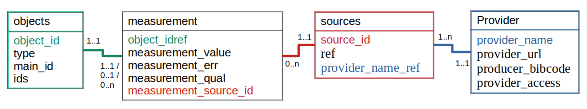
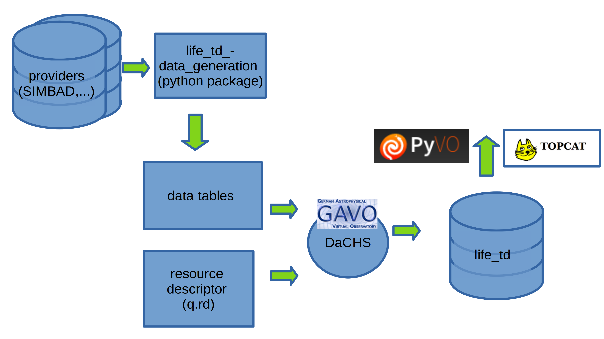
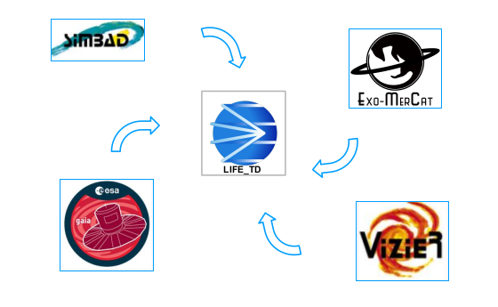
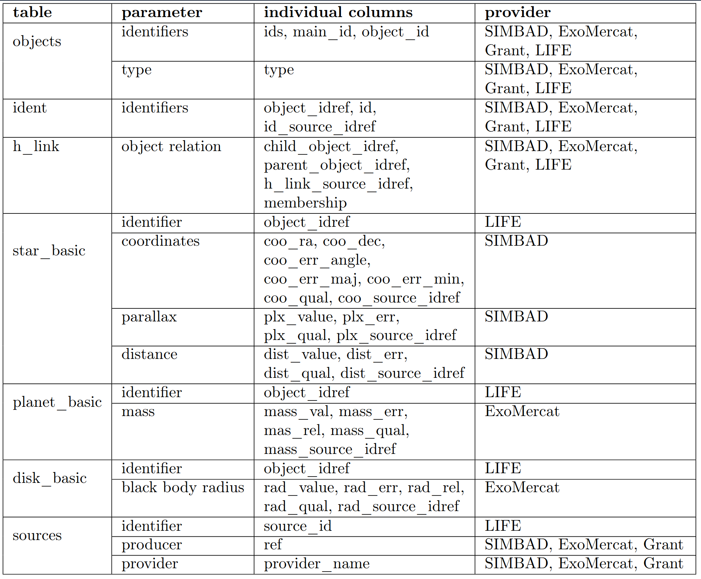

.. _architecture:

Architecture
============

.. _architecture_intro:

Introduction
------------

Let's start with a bit of terminology used when dealing with databases. A `database` is a collection of data. They support electronic storage and maniputlation of data. `Data` itself are facts related to any object in consideration. For example name, age, temperature. A picture, image, file, etc. can also be considered data. There are different ways in which people can interact with the database. In database terminology those are called use cases and describe what a user wants to get out of that interaction. They have consequences on the database design. One of the outcomes whas that we needed the LIFE Target Database to be a `relational database`. That means the data is stored in tables linked to each other with relations. Those tables and relations can be visualized using a `data model`. The use cases and data model for `life_td` are explained in the sections below. 

Use Cases
---------

(TBD add tree for use cases and implementation consequences)

We considered the following five use cases:

A: Catalog extraction for main science objective of LIFE
B: Easy access for fellow scientists
C: Low maintenace for database administrator to save costs.
D: Identify important missing data for future observation proposals.
E: Flexible database design enabling easy expansion in form of adding parameters (e.g. metalicity), providers (e.g. TESS) or adapt to other use cases that might come up in the future (e.g. planned non detection information).
F: Provide context for analysis of data obtained by LIFE.

Which have the following consequences on the database features:

A1: 30pc cut -> max distance at which we can in reasonable time observe desired planet
A2: Main stellar parameters (name, position, distance, spectral type, effective temperature, mass, radius)
A3: Multiplicity information to predict stable planetary orbits as well as take into account lower planet occurence rates in multiples.
A4: Disk information to predict observability. Exozodi as noise source.
A5: Planet information to reduce detection time where planets already known or ruled out from nondetection or Hot Jupiter relation to habitable zone planets.
A6: Best parameters of data collected from different providers.

B1: VO compatibility
B2: Example queries to mitigate ADQL knowledge deficites.
B3: tutorials to help create catalog for own science project

C1: Data ingestion as automated as possible. This is achieved by prefering VO compatible data providers over other databases. Those are in turn prefered over modeled data and as a last resort literature data is collected.
C2: GAVO published, they take case that server runs smoothly.
C3: Everything public and documented to have good knowledge transfer in case of administrator change.

E1: Careful analysis of not only short term use cases but also mid and long term ones. 
E2: Designing and reiterating of the data model. 

.. _architecture_data_model:

Data Model
----------

We used the Unified Modeling Language (UML) to create our data model. Each table in the database is represented as a box called a class. The columns of the table are called attributes. 

.. image:: classdiagramexplanation.png

The figure below is the general structure of the current data model. It went through many iterations to reach this point. We started with what kind of data we wanted to have in the database and normalized the model as much as possible. Normalization is the concept in database design on how to reduce data redundancey (e.g. having the same information save multiple times in the database)
and improve data integrity (e.g. accumulations of errors occurring during data maintenance). Higher
normalizations have the benefit of write performance (minimized redesign when extending the database structure, and anomaly resistance) at the cost of read performance (e.g. querying). However, it turned out that due to the high normalization our database became too complex with manifested in the way that our queries got too complicated. We therefore looked at example data we wanted to ingest into the database and how to extract it again. It turned out, that our database would have many similarities with the SIMBAD database. We drafted a new data model inspired by the one from SIMBAD and aspects of our older complex data model. Compared to SIMBAD we included additional classes for disks and planets and leaft out classes that were irrelevant for us (e.g. bibliography, flux).

TBD: Elaborate on keys as well as value, err, quality,...

Ingestion Pipeline
------------------

Content
-------

TBD: list providers and measurements.

TBD: insert example measurement tables

